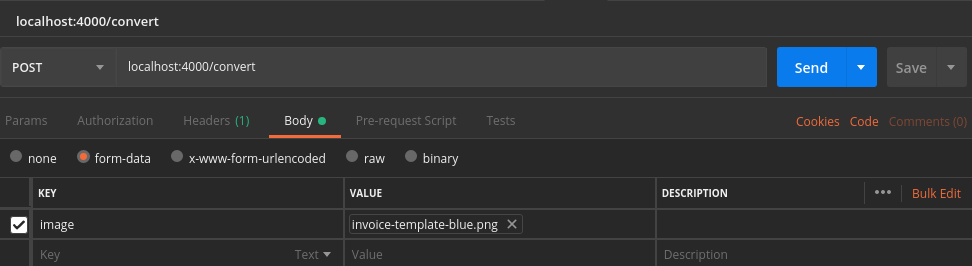
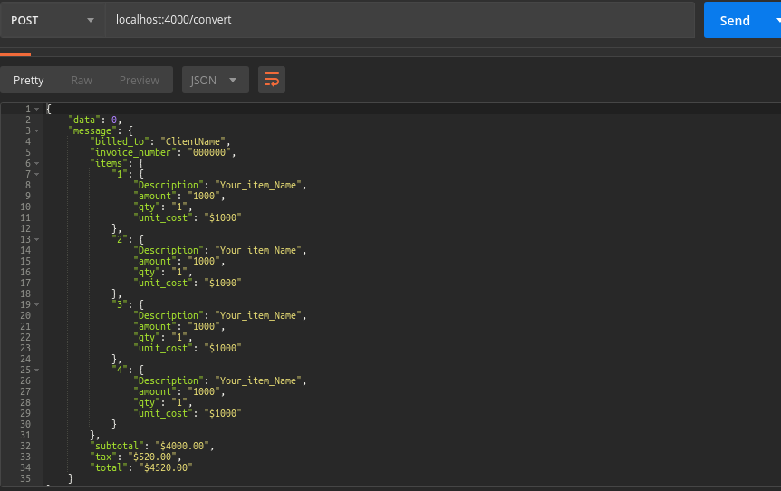
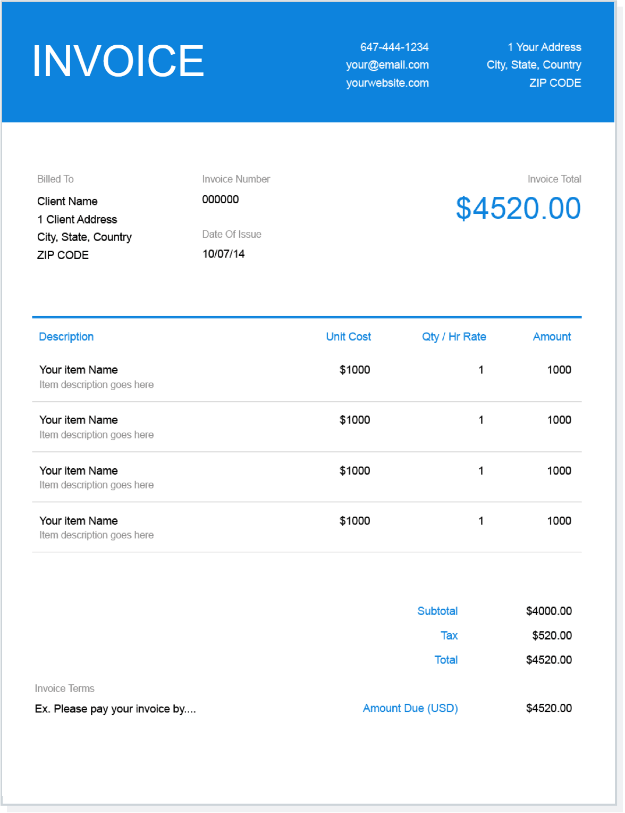
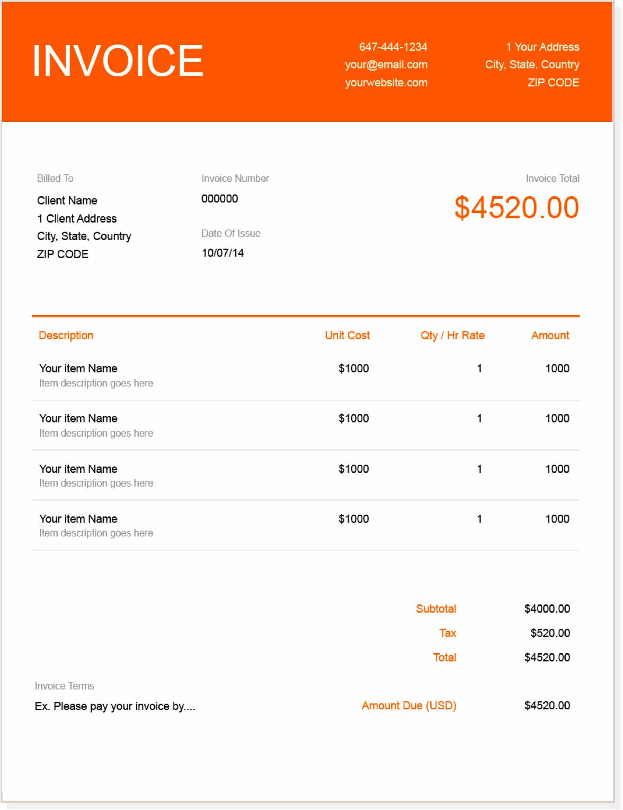

# ocr_example

A simple data extraction using pytesseract and openCV

# Libraries Used
pytesseract  
openCV  
matplotlib  
flask  

# Usage
python oce_server.py

# Request format

# Response

# Test Invoices

